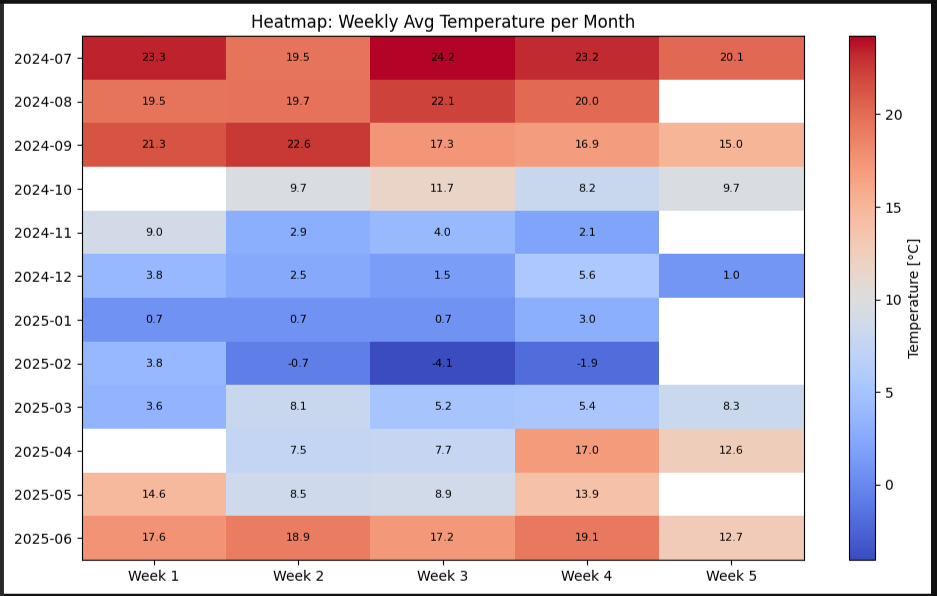
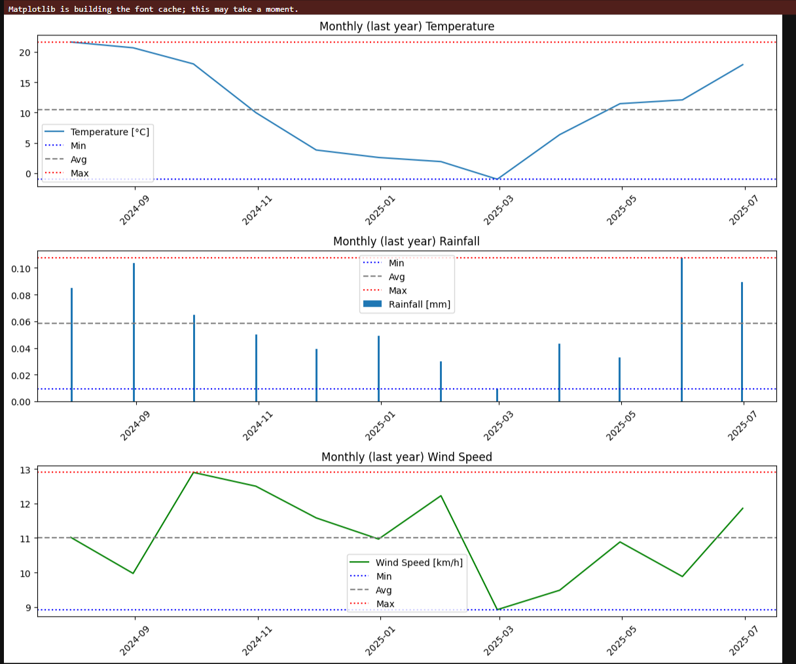
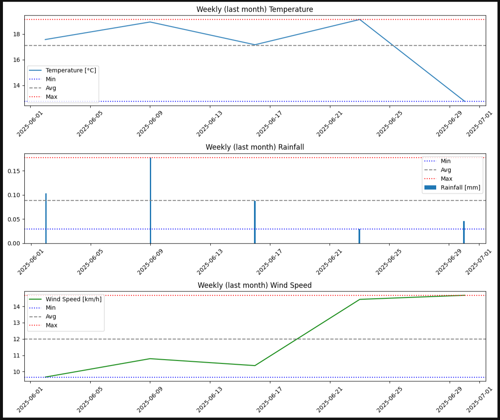
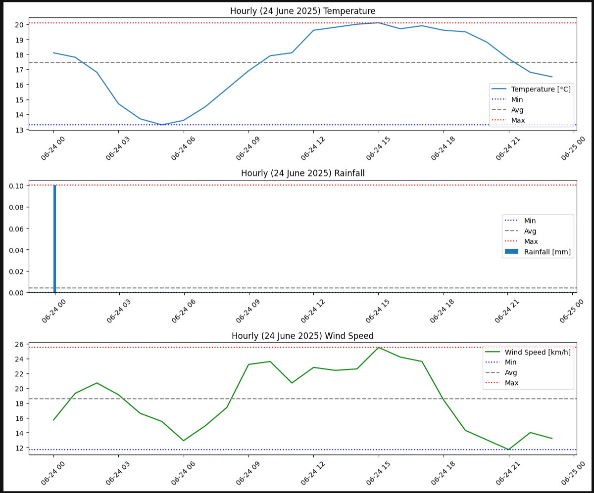
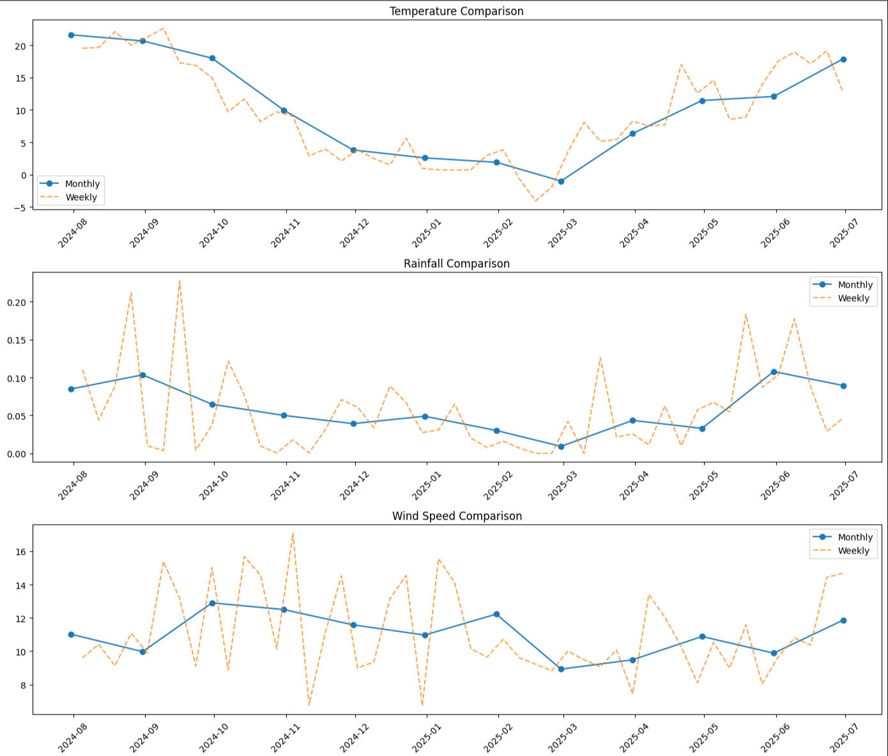
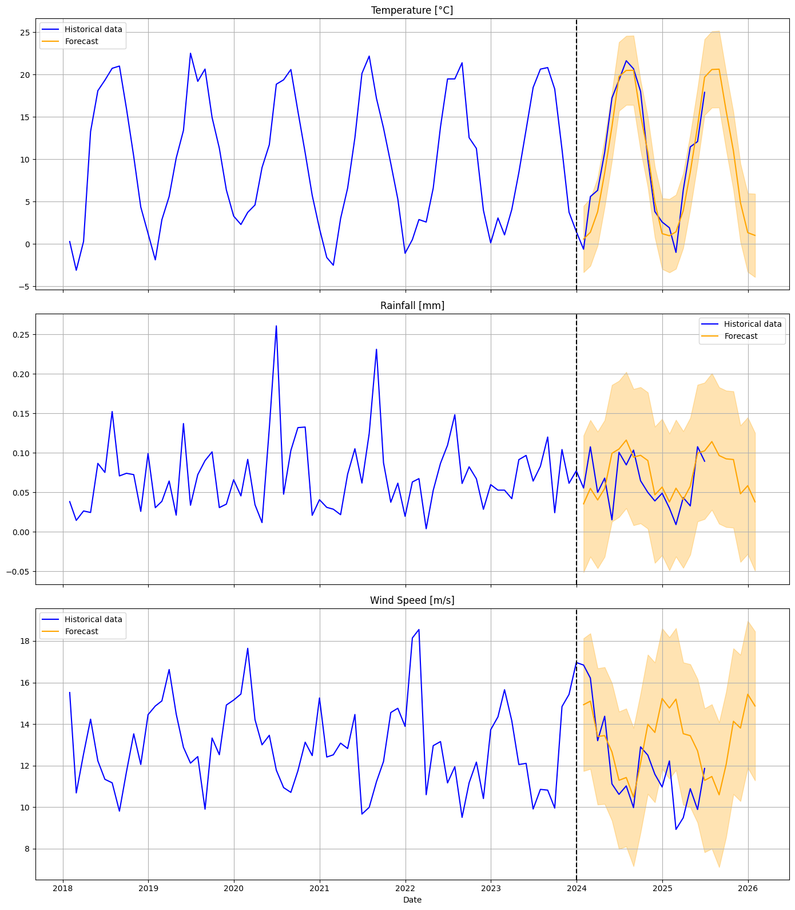

# Weather Data Analysis Results for Warsaw

This file presents the results of weather data analysis for Warsaw, based on data fetched from the Open-Meteo API and processed using Apache Spark and Pandas. The goal was to analyze meteorological conditions in Warsaw over recent months using hourly, weekly, and monthly aggregations, with visualizations and comparisons of key weather indicators.

## Used Libraries and Environment

The code was executed in a PySpark environment, which enabled efficient processing of large datasets directly within the notebook. The following tools were used:
- `pyspark` – for CSV reading and basic data transformation,
- `pandas` – for more advanced manipulation and statistics,
- `matplotlib` – for creating plots and heatmaps,
- `numpy` – for supporting numerical operations.

The data was read from three CSV files: hourly (`hourly`), weekly (`weekly`), and monthly (`monthly`). Example configuration:

```python
hourly_sdf = (spark.read.options(**read_opts)
                        .csv(f"{PREFIX}/warsaw_weather_hourly.csv")
                        .withColumn("time", to_timestamp("time")))
```

After conversion to Pandas DataFrames, data was sorted, filtered, and prepared for visualization and statistical analysis.

## Data Analysis and Visualization

All visualizations were created using **custom Python functions defined in the project code** (e.g. `plot_trends`, `compare_monthly_weekly`). These are not prebuilt functions from any library — they were implemented manually as part of this analysis and then used throughout the notebook. This made it possible to create consistent, tailored visual representations for various time resolutions (hourly, weekly, monthly), focusing on trend discovery and variability.

### 1. Weekly Average Temperature Heatmap

The heatmap shows weekly average temperatures over the past 13 months, grouped by weeks within each month. This helps to observe seasonal trends, temperature spikes, and stability in weather conditions.



---

### 2. Monthly Trends (last year)

This visualization shows changes in temperature, precipitation, and wind speed on a monthly basis. For each variable, minimum, maximum, and average values are presented.



Code fragment used for plotting:

```python
plot_trends(monthly_df, "Monthly (last year)")
```

---

### 3. Weekly Trends (last month)

Similar to the monthly analysis, this chart presents data from the last 5 weeks. It allows a closer look at short-term weather trends, particularly useful during spring and summer.



---

### 4. Hourly Trends (June 24, 2025)

This visualization captures weather conditions on an hourly basis for a single day – showing fluctuations in temperature, rainfall, and wind speed from morning to evening.



---

### 5. Comparison: Monthly vs Weekly

This chart compares monthly and weekly data for temperature, precipitation, and wind speed. It helps to identify differences and variability across different levels of data aggregation.



Code used for comparison:

```python
compare_monthly_weekly(monthly_df, weekly_full_year_df)
```

---

### 6. Prediction

## Weather Forecasting with the SARIMAX Model – Analysis Overview
In this analysis we used the SARIMAX model, an extended version of classical ARIMA.
Its main strength is the ability to model time-series data that exhibit trends, clear seasonality and, if needed, exogenous variables (none were used here).

order = (p, d, q) – non-seasonal components:

p – number of autoregressive lags (AR),

d – degree of differencing to achieve stationarity (I),

q – number of moving average lags (MA).

seasonal_order = (P, D, Q, s) – seasonal components:

P, D, Q – seasonal counterparts of p, d, q,

s – length of the seasonal cycle (e.g., 12 for monthly data, 52 for weekly data, 24 for hourly data).

## Results & Observations
Monthly forecasts

Best performance. Forecasts reproduce realistic seasonal swings and long-term trends.

Why monthly aggregation helps rainfall & wind

- Daily/weekly rainfall can be zero or spike after a single storm.

- Averaging over a month smooths out this noise and reveals clear seasonal structure, which SARIMAX captures very well.

Weekly & hourly forecasts
Weekly: acceptable accuracy, though naturally noisier—especially for rainfall and wind.

Hourly: SARIMAX still produces credible temperature forecasts several days ahead—useful for short-term, local decision-making.

Example of monthly predictions



## Summary

This complete analysis provides a full picture of atmospheric conditions in Warsaw – from granular hourly data to high-level monthly overviews. Using Spark and Pandas for data processing, followed by visualization in Matplotlib, enabled the creation of clear and informative charts.
